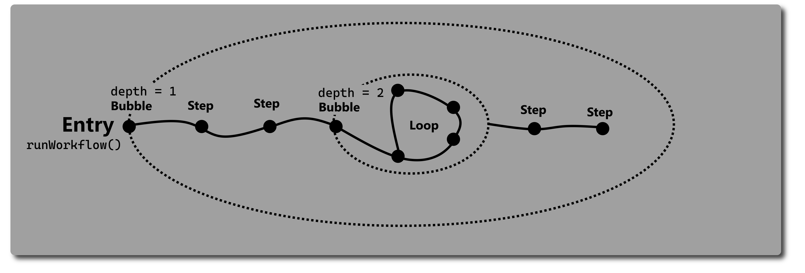

# Stepflow - Modular workflow composition
[](https://github.com/zopnote/stepflow/actions/workflows/dart-project-quality.yml)


A Dart package for building modular workflows. 
It introduces step-based composition, where each step is a self-contained unit of logic or interaction. 
The structure makes it easier to break down processes to into more reusable steps. Improving clarity, 
testability, and maintainability of toolchains or workflows. It's like Flutter but for workloads.

You can use Stepflow in every Dart project:
````bash
dart pub add stepflow
````

## Common workflow design
A workflow in Stepflow consists of a chain of ``Step``s. 
They consist of just an execute function, that has to return the next ``Step``.
Through the design of the workflow pipeline, a workflow and it's steps,
can have states and are able to respond to different situations.

This opens the way for the most important step. 
The ``Bubble``, that contains logic about 
the execution of steps inside of it, most workflows will be started inside one.


With ``context.pop()`` you can always escape the current bubble
directly with an error message. With ``context.close()`` you can exit all bubbles.
If you want an own behaviour of execution,
you should create a subclass of ``Bubble``. Documentation is in the source files and examples are [here](example).

## Composition of Steps
If you just want to build a workflow inside an application, you should use the ``ConfigureStep``. 
There are cases where you have to extend ``Step`` or ``Bubble``, but the most workflows will be less
complex and more readable if you just compose steps with ``ConfigureStep``. It is quite the same as ``StatelessWidget``s in Flutter.
**For example:**
````dart
class PrintOutDartVersion extends ConfigureStep {
  const PrintOutDartVersion();
  @override
  Step configure() {
    String version = "";
    // Chain is the bubble of this Step, with context.pop() you could escape.
    return Chain(
      steps: [
        Check(
          name: "Ensures the availability of the Dart SDK",
          programs: ["dart"],
          searchCanStartProcesses: false,
          onFailure: (context, notFound) {
            context.close("The Dart SDK isn't available on this platform.");
          },
        ),
        Shell(
          name: "Receives the Dart SDK's version",
          program: "dart",
          arguments: ["--version"],
          onStdout: (context, chars) {
            version += String.fromCharCodes(chars);
          },
        ),
        Runnable(name: "Prints out the version", (context) {
          print(
            "The version of the installed Dart SDK is " +
                version.split(" ")[3] +
                "!",
          );
        }),
      ],
    );
  }
}
````
It is a step, that will atomize itself into the steps, it is composed of. A ``ConfigureStep`` has to be extended and it`s ``configure()``-function should be overridden.
It returns then a composition of steps. A list and explanation of the common steps can be found in their sources [here](lib/src/core).

## CLI
Stepflow also comes with framework-like-styled glue code for CLI commands and flags.
A ``Command`` often consists of the following settings:
* use - _The name of the command_
  * If the command is the base of the application the ``use`` has just ascetic purpose 
    other than describing in the syntax.
* description - _Useful information about the command_
* flags - _A list of ``Flag`` that will be parsed from the command line and then added to the ``CommandInformation``_
* run function - _Whatever the command should do_
  * Has to return a ``Response``, that will be printed out to std.
  * The ``CommandInformation`` holds the data of the current command and it's processing.
  * ``run()`` can be async

**Example:**
````dart
import 'package:stepflow/io.dart';

Future<void> main(List<String> rawArgs) => runCommand(
  Command(
    use: "my_cli",
    description: "Just a short cli example",
    hidden: true,
    inheritFlags: false,
    flags: [BoolFlag(name: "smile", value: false)],
    run: (info) {
      if (info.getFlag("smile").value) {
        return Response(":)", Level.status);
      }
      return Response(info.formatSyntax(), Level.status);
    },
    subCommands: [
      Command(
        use: "greet",
        description: "Greets the entire world.",
        run: (info) {
          return Response(
            "Hello world! " + (info.getFlag("smile").value ? ":)" : ""),
          );
        },
      ),
    ],
  ),
  rawArgs,
);

````
For more documentation about ``Command`` look inside the [documentation in the source files](lib/src/io/command.dart).

